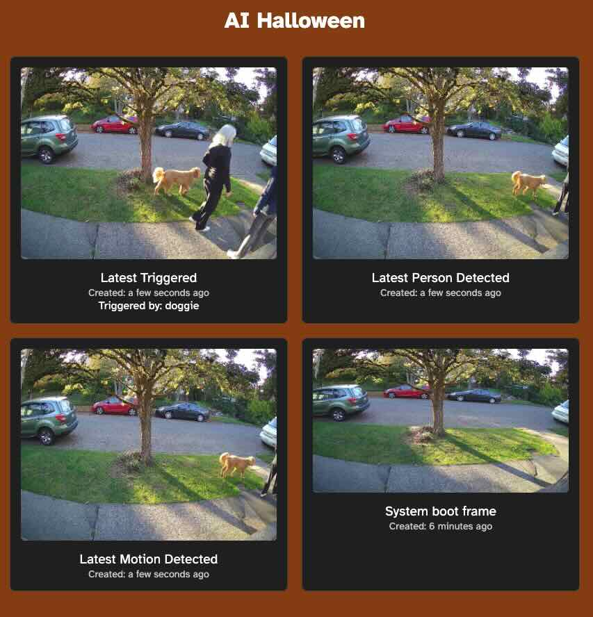

# AI Halloween - A Spooky Computer Vision Project

This is Jacqueline.  She watches everybody walking by, and if she seems something interesting, she'll react.


It's super simple to adjust what she reacts to, but currently she's programmed to react to:

- **Dogs** - She'll make a snarky comment, or maybe play some animal noises.
- **Baby Strollers** - She'll say something slightly menacing like "Ooooh a baby!"
- **People taking photos** - She will make a snarky comment.
- **People pointing at her** - She will make a snarky comment.
- **People staring at her** - She will say Hi.

Last year if she got really riled up she'd blast you with a fog machine (DMX-controlled) but it seems I forgot to push that code to github after halloween, so it's lost on some micro-SD card somewhere in my house.  I'll just rewrite it.

## YAML Configuration

The behavior of Jacqueline is configured using a YAML file. Each detector is defined with a set of properties that determine what it reacts to and how it responds. Below is the format of the YAML configuration:

```
detectors:
  - name: "doggie"
    query: "Detect dogs in the frame"
    soundfile_dir: "sounds/dogs"

  - name: "baby-stroller"
    query: "Detect baby strollers in the frame"
    soundfile_dir: "sounds/babies"

  - name: "taking-photo"
    query: "Detect people taking photos"
    messages:
      - "Say cheese!"
      - "My hashtag is A.I. Halloween"
```

### YAML Fields

- **name**: A descriptive name for the detector.
- **query**: The query text used to identify the object or action in the frame.
- **soundfile_dir**: The directory path where sound files related to the detector are stored.  If provided, Jacqueline will randomly choose one of the files in the directory to play when the detector is triggered.
- **messages**: A list of messages that Jacqueline can say when the detector is triggered.  These will be rendered as a voice.  Messages are only used if there is no `soundfile_dir`.

## System Setup

Install poetry if you haven't:

```bash
curl -sSL https://install.python-poetry.org | python3 -
export PATH="$HOME/.local/bin:$PATH"
```

Make sure you have the right prerequisites installed.  For Ubuntu:

```bash
sudo apt install -y libgl1-mesa-glx ffmpeg tmux
```

Install python dependencies

```bash
poetry install
```

### Camera setup

Create a default camera config and confirm that it works.

```
poetry run framegrab autodiscover > camera.yaml
poetry run framegrab preview ./camera.yaml
```

### Running automatically

Add something like this to your crontab:
(Update the directory to be what you think it should be.)

```
@reboot $HOME/aihalloween/onboot.sh
```

Cron can be tricky.  You likely want a line like this to set the `PATH` correctly: 
(Update the username if you're not using `ubuntu`) 

```
PATH=/usr/local/bin:/usr/bin:/bin:/usr/sbin:/sbin:/home/ubuntu/.local/bin/
```

## Running

Get a [Groundlight API token](https://code.groundlight.ai/python-sdk/docs/getting-started/api-tokens)
and set it as an environment variable like

```bash
export GROUNDLIGHT_API_TOKEN=api_2Q...
```

Then run

```bash
poetry run python ./mainloop.py ./halloween.yaml
```

### What to do?

Try taking a picture of the camera, or pointing at it, or just staring.

## Monitoring

There's a simple web server running on the machine that will show you the latest images.  Just open a web browser and go to http://your-machine-ip:8000/

It will show you the most recent images of various categories (triggered, motion detection, person) and if things are working properly, automatically reload them as new images come in.




